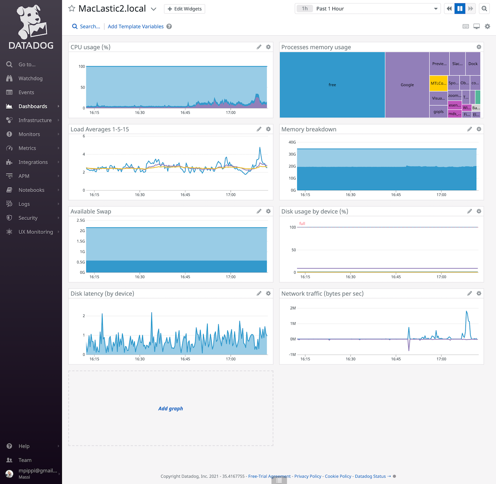
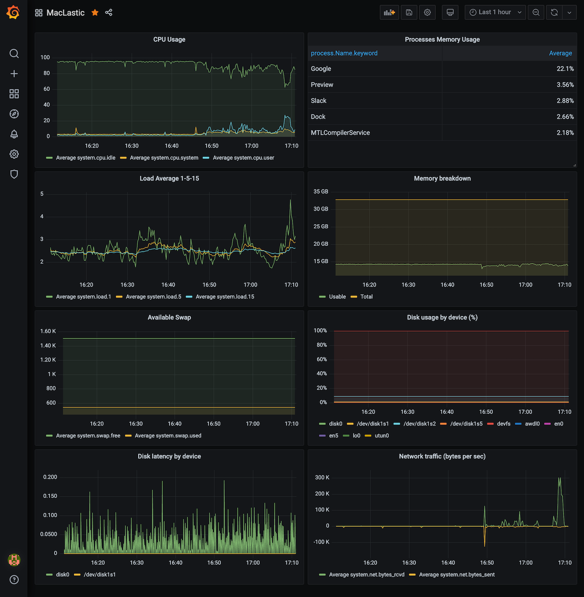

[](https://github.com/masci/threadle/actions/workflows/test.yaml)
[](https://goreportcard.com/report/github.com/masci/threadle)

# Threadle

Threadle can ingest metrics from a Datadog Agent and send them to a custom storage using different plugins.

A use case example would be using [Elasticsearch](https://www.elastic.co/elasticsearch/) to store the
timeseries and having [Grafana](https://grafana.com/oss/grafana/) visualize data.




## Quickstart

Install threadle:

```bash
$ go get -u github.com/masci/threadle
go: downloading github.com/masci/threadle
```

Threadle discards all the messages coming from the Datadog Agent out of the box, so you have to enable at
least one output plugin. Create a basic configuration file named `threadle.yaml`:

```yaml
plugins:
  logger:
```

Launch Threadle from the same directory containing the config file:

```bash
$ $GOPATH/bin/threadle -c
Initializing plugin: logger
```

Alternatively, you can use the Docker image to achieve the same:

```bash
$ docker run -e THREADLE_PLUGINS="{\"logger\":{}}" masci/threadle:unstable
INFO Initializing plugin: logger
INFO Threadle running at 0.0.0.0:3060
```

By default Threadle listens on port `3060`, point the Datadog Agent there by adding the following to your
`datadog.yaml` configuration file:

```yaml
additional_endpoints:
  "http://localhost:3060": ""
```

Restart the Datadog Agent, you're all set.

## Plugins

Threadle is a small tool I built for myself so it doesn't offer much out of the box, but adding a plugin
shouldn't be hard.

### Logger

The logger plugin just prints the payload received from the Datadog Agent on `stderr` in JSON format. It
is mostly intended for debugging but it has an option to make the log lines [ECS](https://www.elastic.co/guide/en/ecs/current/index.html)
compatible, in case you want to send them straight to an index in Elasticsearch without additional setup.
The plugin only has one configuration option:

```yaml
logger:
  ecs_compatible: true
```

### Elasticsearch

The `elasticsearch` plugin transforms Datadog metric points into Elasticsearch documents that will be
stored in a timeseries fashion, using the
[Bulk API](https://www.elastic.co/guide/en/elasticsearch/reference/current/docs-bulk.html) to ingest data.

The plugin accepts few config options:

- `cloudid` to setup your ES cluster location if you're using [Elastic Cloud](https://elastic.co/cloud).
- `addresses` can be used to specify the URL of the ES nodes to use when `cloudid` is not set
- `username` and `password` to authenticate the client
- `index` to specify which ES index to use to store data
- `exclude_metrics` to ignore Datadog metrics using one or more regexps matching the metric name

A fully functional example might be:

```yaml
plugins:
  elasticsearch:
    addresses:
      - https://es.example.com:9243
    username: "test"
    password: "secret!"
    index: "datadog-agent"
    exclude_metrics:
      - .*datadog.*
```
